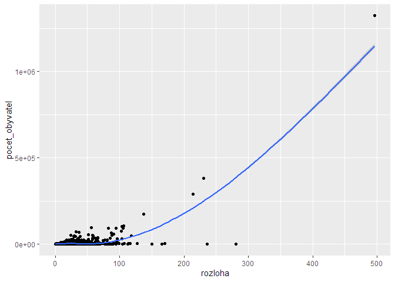
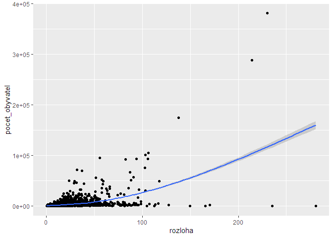
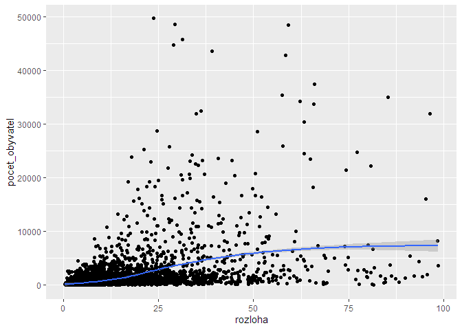
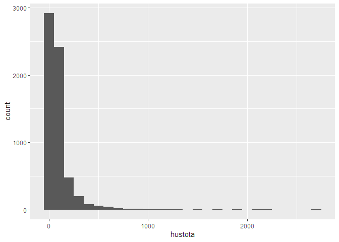
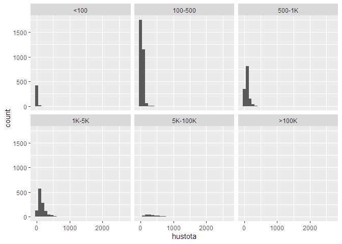
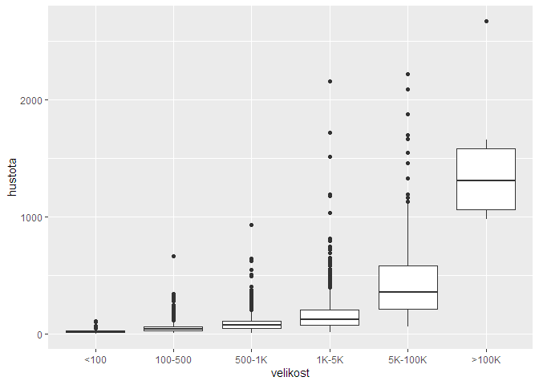
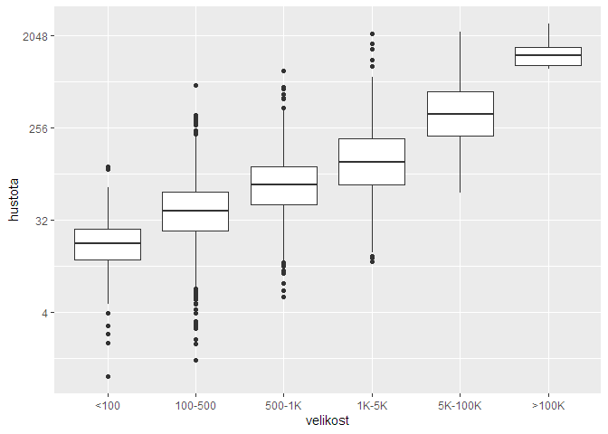

# Kolik plochy mají k dispozici obyvatelé obcí ČR

Když se teď při volnočasových aktivitách musíme zdržovat na území své obce, zajímalo mě, o jak velkou plochu vzhledem k počtu obyvatel obcí vlastně jde. Stáhl jsem si veřejná data a udělal takovou rychlou minianalýzu.

## Závisí počet obyvatel na rozloze obce?

Bylo by fajn, kdyby závisel -- hodně obyvatel by mělo k dispozici velkou plochu a málo obyvatel malou. Je tomu tak?

Podle tohoto grafu počet obyvatel s rozlohou obce stoupá, jenže to vypadá, že výsledek hodně ovlivňuje pár obcí s největším počtem obyvatel.

<!-- -->

Když odfiltruju obce nad 500 tisíc obyvatel (čili Prahu), vapdá to takhle:

<!-- -->

Z toho je mj. vidět, že většina obcí má do 50 tisíc obyvatel a do 100 km² rozlohy. Když vyfiltruju jen ty, dostanu:

<!-- -->

Jo, to už je asi pro většinu obcí (ne nutně pro většinu obyvatel) realističtější obrázek.

## Hustota obyvatelstva v obcích

Kolik obyvatel připadá na jeden kilometr čtvereční nebo kolik plochy má k dispozce jeden obyvatel. To je ta zásadní otázka.

A odpověď nevypadá tak špatně. Ve většině obcí připadá na kilometr čtvereční maximálně 200 obyvatel a ve většině z té většiny dokonce jen maximálně 100 obyvatel.

<!-- -->

Opět je ale vidět, že je rozdělení obcí podle velikosti velmi nerovnoměrné. Malých obcí je moc, velkých málo. Zkusil jsem proto rozdělit obce do skupin podle počtu obyvatel a zobrazit rozložení hustoty v těchto velikostních skupinách.

<!-- -->

Z toho ale moc vidět není, tak snad pomůže boxplot:

<!-- -->

Jo, to už vypadá líp, na první pohled je vidět, že hustota roste s počtem obyvatel a zároveň má ve větších městech větší rozptyl. Medián hustoty obcí s 5K až 100K obyvateli je okolo 300, většina obcí nad 100K má hustotu obyvatel nad 1000. Detaily malých obcí se ale schovají v měřítku, takže ještě zkusím logaritmickou osu y:

<!-- -->

Tady už je dobře vidět, že nejmenší obca mají medián hustoty pod 30.

## Žebříčky

### Top 10 poražených

Ve kterých obcích je nejvíc obyvatel na kilometr čtvereční? Jsou to tyhle:

|nazev_obce                     | pocet_obyvatel|    rozloha|  hustota|
|:------------------------------|--------------:|----------:|--------:|
|Praha                          |        1324277| 496.255783| 2668.537|
|Havířov                        |          71200|  32.073004| 2219.936|
|Zastávka                       |           2573|   1.194105| 2154.752|
|Teplice                        |          49731|  23.782526| 2091.073|
|Kladno                         |          69337|  36.971055| 1875.440|
|Dobrá Voda u Českých Budějovic |           2662|   1.548119| 1719.506|
|České Budějovice               |          94463|  55.723313| 1695.215|
|Chomutov                       |          48635|  29.261253| 1662.096|
|Brno                           |         381346| 230.229581| 1656.373|
|Mladá Boleslav                 |          44740|  28.912824| 1547.410|

### Top 10 vítězů

A kde jsou na tom nejlépe a mají nejvíc místa na obyvatele? Šumava ftw!

|nazev_obce       | pocet_obyvatel|   rozloha|   hustota|
|:----------------|--------------:|---------:|---------:|
|Modrava          |             78|  81.62060| 0.9556411|
|Prášily          |            154| 112.31811| 1.3711057|
|Stožec           |            205| 104.69638| 1.9580429|
|Horská Kvilda    |             60|  29.85166| 2.0099383|
|Kryštofovy Hamry |            150|  68.44834| 2.1914338|
|Přebuz           |             73|  29.76907| 2.4522095|
|Přední Výtoň     |            219|  77.81487| 2.8143722|
|Pohorská Ves     |            239|  81.26135| 2.9411275|
|Český Jiřetín    |             99|  33.64247| 2.9427090|
|Kvilda           |            139|  45.20961| 3.0745675|

## Závěr

Životní prostor mají teď obyvatelé ČR značně nerovný. Zatímco v obcích s nejmenší hustotou obyvatel připadají na kilometr čtvereční jen nízké jednotky lidí, v obcích s největší hustotou to je lidí přibližně tisíckrát víc.

